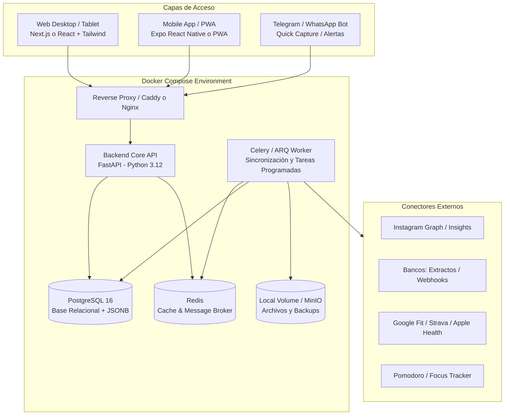

# 📘 Product Requirements Document (PRD) — Personal OS

**Versión:** 1.0.0  
**Fecha:** Septiembre 2026  
**Estado:** Borrador / Plan Maestro  
**Autor:** F4brizi & Antigravity  

---

## 1. Visión y Propósito del Producto

**Personal OS** es un centro de control y recopilación de vida personal (*Personal Operating System*) diseñado con arquitectura moderna basada en microservicios contenerizados. 

El sistema busca:
1. **Centralizar información fragmentada** de múltiples áreas: finanzas, productividad (pomodoros), condición física y presencia digital (redes).
2. **Crecer en integraciones (conectores)** antes que en volumen masivo de datos.
3. **Ofrecer experiencias diferenciadas por dispositivo:**
   - **Escritorio / Web:** Análisis profundo, conciliación financiera, dashboards visuales, configuración avanzada y gestión masiva.
   - **Móvil / Celular:** *Quick capture* (registro en 3 segundos), temporizador/foco activo, ingesta rápida de gastos y check-in diario.
4. **Despliegue híbrido:** Funcionar 100% de manera local en desarrollo con `docker-compose` y estar preparado para despliegue en un servidor o VPS propio (Coolify, Railway, Hetzner, etc.) sin reescribir código.

---

## 2. Arquitectura Tecnológica Recomendada



### 2.1 Backend (API & Ingesta)
- **Framework:** **FastAPI (Python 3.12)**.
  - *¿Por qué Python?* Es el estándar absoluto para ingesta y parsing de datos (parsers de extractos bancarios PDF/Excel/OFX, scrapers/APIs de redes sociales, librerías de fitness, conectores de IA).
  - *ORM / DB Access:* **SQLAlchemy 2.0 / SQLModel** con migraciones gestionadas por **Alembic**.
  - *Manejo de Tareas Asíncronas (Cron/Jobs):* **Celery** o **ARQ** respaldado por **Redis**, para programar la sincronización periódica de conectores sin bloquear la API.
- **Base de Datos:** **PostgreSQL 16**.
  - Soporte nativo de `JSONB` para almacenar payloads crudos de integraciones que cambian con el tiempo, combinando datos estructurados y flexibles.

### 2.2 Frontend Web (Desktop & Tablet)
- **Framework:** **Next.js (App Router)** o **Vite + React 19 + TypeScript**.
- **UI & Estilos:** **Tailwind CSS + shadcn/ui** (componentes accesibles y modernos).
- **Gráficos & Visualización:** **Tremor** / **Recharts** para métricas financieras y de productividad.
- **Enfoque:** Pantalla completa, multiventana o pestañas modulares, tablas densas para conciliación bancaria y visualización de tendencias anuales.

### 2.3 Frontend Móvil (Teléfono)
- **Estrategia recomendada:** **PWA (Progressive Web App) optimizada** con opción a empaquetar con **Capacitor** o **React Native (Expo)**.
- **Enfoque móvil:** Acciones de un solo toque:
  - Botón flotante `+` para carga rápida (ej: "Gasto de $12.500 almuerzo").
  - Iniciar / pausar sesión de Pomodoro.
  - Check-in matutino y nocturno de energía y hábitos.
  - Sincronización offline-first básica.

---

## 3. Matriz de Integraciones & Estrategia de Conectores

El sistema utilizará un patrón **`Connector Plugin Architecture`**: cada fuente de datos implementa una interfaz base común:
`IConnector`: `authenticate()`, `sync(since_date)`, `validate_status()`, `get_schema()`.

| Fuente | Prioridad | Método de Ingesta | Datos Extraídos | Dificultad |
| :--- | :---: | :--- | :--- | :---: |
| **Pomodoros / Enfoque** | 🔴 **P1 (Inmediata)** | Módulo nativo en la API + sincronizador de sesiones | Duración, proyecto/tag, interrupciones, tasa de éxito | Baja |
| **Finanzas & Conciliación** | 🔴 **P1 (Inmediata)** | Parser de extractos (CSV, XLS, PDF) + Formulario manual | Movimientos, saldos, categorías, estado de conciliación | Media |
| **Fitness & Salud** | 🟡 **P2 (Media)** | Webhook / API OAuth (Strava, Google Fit / Health Connect) | Pasos diarios, calorías activas, minutos de entrenamiento, sueño | Media |
| **Instagram** | 🟢 **P3 (Posterior)** | Meta Graph API (Creator/Business) o export de datos | Seguidores, impresiones, engagement, guardados personales | Alta (por APIs Meta) |
| **Telegram Bot (Recomendación)** | 🔴 **P1 (Inmediata)** | Long-polling / Webhook bot | Ingesta por texto y voz desde el celular sin abrir apps | Muy Baja |

---

## 4. Esquema de Dashboards y Formularios

### 4.1 Experiencia Web (Escritorio)

#### 🖥️ Vistas Principales (Dashboards):
1. **Executive Daily Dashboard (Home):**
   - Resumen del día actual: tiempo de enfoque acumulado (Pomodoro), balance neto del mes, pasos/entrenamiento de hoy, gráfico de distribución del tiempo.
   - Calendario semanal de productividad y rachas.
2. **Módulo de Finanzas & Conciliación:**
   - **Dashboard Financiero:** Ingresos vs. Gastos, gasto por categorías, flujo de caja estimado.
   - **Mesa de Conciliación:** Tabla interactiva a dos columnas (o matriz) para marcar transacciones como conciliadas, detectar duplicados o asignar comprobantes de pago.
3. **Módulo de Enfoque y Trabajo (Deep Work):**
   - Mapa de calor (*heatmap* estilo GitHub) de horas productivas.
   - Rendimiento por proyecto o tipo de tarea.
4. **Módulo de Fitness & Bienestar:**
   - Comparativas semanales de actividad física y correlación entre ejercicio y productividad.
5. **Configurador de Integraciones & Conectores:**
   - Tarjetas con estado de cada conector (Última sincronización, errores, botón de "Forzar sincronización manual").

#### 📝 Formularios Clave (Web):
- **Importador de Extractos Bancarios:** Zona drag-and-drop para arrastrar archivos Excel/CSV/PDF de bancos (Santander, BBVA, Mercado Pago, etc.) con mapeo visual de columnas.
- **Editor de Reglas de Auto-categorización:** *"Si la descripción contiene 'Uber', categorizar como Transporte"*.
- **Configuración de Conectores:** Formularios seguros para ingresar tokens o credenciales de APIs.

---

### 4.2 Experiencia Móvil (Teléfono)

#### 📱 Vistas Principales (Mobile Views):
1. **Quick Capture Home:**
   - Pantalla minimalista con 3 grandes accesos: **Nuevo Gasto**, **Iniciar Pomodoro**, **Nota/Idea Rápida**.
2. **Active Focus Timer:**
   - Temporizador visual de Pomodoro con botón de pausa, conteo regresivo y selector del proyecto actual.
3. **Daily Digest (Timeline):**
   - Feed cronológico del día: *"09:00 - 45m Pomodoro (Proyecto X)"*, *"13:15 - Gasto $15.000 (Almuerzo)"*, *"18:30 - 5.4 km Carrera (Strava)"*.

#### 📝 Formularios Clave (Móvil):
- **Formulario de Gasto Rápido (3 campos obligatorios):** Monto numérico gigante $\to$ Categoría (botones táctiles rápidos) $\to$ Medio de pago.
- **Check-in Diario:** Escala de 1 a 5 para nivel de energía, horas de sueño y notas breves.

---

## 5. Recomendaciones de Producto (Qué agregar y qué quitar/postergar)

### ✅ Qué SÍ agregar (Aportes de alto impacto y bajo costo):
1. **Bot de Telegram / WhatsApp para captura inmediata:**
   - *Por qué:* Abrir una app en el celular lleva tiempo. Escribirle al bot: *"Gasto 8500 cena"* o enviar un audio *"Hice 2 pomodoros de estudio"* permite capturar información sin fricción usando IA para parsear el texto.
2. **Motor de Reglas de Conciliación Automática:**
   - El 80% de los gastos recurrentes (Netflix, alquiler, supermercado) se pueden conciliar automáticamente con reglas regex simples sobre el extracto.
3. **Endpoint de Webhook Genérico (`/api/v1/ingest/webhook`):**
   - Para que cualquier app que soporte webhooks o atajos de iOS (Shortcuts) / Android (Tasker) pueda enviarle datos al Personal OS directamente.

### ⚠️ Qué quitar o postergar (Puntos de riesgo):
1. **Scraping automatizado directo a portales bancarios:**
   - *Riesgo:* Los bancos cambian sus portales constantemente, usan 2FA dinámico y bloquean IPs. Provoca mantenimiento constante y frustración.
   - *Alternativa inteligente:* Importador de extractos (descargas mensuales o periódicas de CSV/PDF) o lectura de emails de notificación de transferencias.
2. **Scraping no oficial de Instagram (sin API oficial):**
   - *Riesgo:* Si se usan scrapers privados de Instagram, Meta suele bloquear cuentas o requerir verificación constante.
   - *Alternativa inteligente:* Comenzar con la API oficial de Meta Graph si se cuenta con cuenta profesional/creador, o bien con la descarga periódica del archivo de datos de Instagram (*Data Export JSON*).

---

## 6. Maquetación del Proyecto (Estructura de Carpetas)

```text
personal-os/
├── docker-compose.yml           # Orquestación de API, DB, Redis y Frontend
├── docker-compose.override.yml  # Configuración específica para desarrollo local
├── .env.example
├── README.md
├── PLAN.md
├── PRD.md
│
├── api/                         # Backend en FastAPI
│   ├── Dockerfile
│   ├── pyproject.toml / uv.lock # Dependencias rápidas con uv
│   ├── app/
│   │   ├── main.py              # Entrada de la API
│   │   ├── core/                # Configuración, seguridad, db engine
│   │   ├── models/              # Modelos SQLAlchemy
│   │   ├── schemas/             # Esquemas Pydantic
│   │   ├── api/v1/              # Routers (endpoints de finanzas, pomodoro, etc.)
│   │   ├── connectors/          # Sistema de plugins de integraciones
│   │   │   ├── base.py          # Clase abstracta IConnector
│   │   │   ├── instagram/
│   │   │   ├── fitness/
│   │   │   ├── bank_parsers/    # Parsers de CSV/PDF
│   │   │   └── pomodoro/
│   │   └── workers/             # Tareas programadas de background
│   └── alembic/                 # Migraciones de base de datos
│
├── web/                         # Frontend Web & Mobile PWA
│   ├── Dockerfile
│   ├── package.json
│   ├── src/
│   │   ├── app/                 # Rutas y páginas
│   │   │   ├── (desktop)/       # Layout enriquecido para pantallas grandes
│   │   │   └── (mobile)/        # Layout minimalista y táctil
│   │   ├── components/          # Componentes UI (shadcn, dashboards)
│   │   ├── lib/                 # Clientes API, helpers
│   │   └── hooks/
│
└── bot/                         # (Opcional) Microservicio del Bot Telegram
    ├── Dockerfile
    └── bot.py
```

---

## 7. Roadmap y Fases de Trabajo

- **Sesión 1 (`session/01-prd-y-plan`):** Aprobación del PRD y esquema de arquitectura.
- **Sesión 2 (`session/02-docker-api-core`):** `docker-compose`, FastAPI base, conexión a PostgreSQL y migraciones Alembic.
- **Sesión 3 (`session/03-modulo-pomodoro`):** Primer módulo funcional completo (API + endpoints + almacenamiento de sesiones de enfoque).
- **Sesión 4 (`session/04-finanzas-extractos`):** Ingesta de datos bancarios (subida de archivos CSV/Excel y motor de conciliación).
- **Sesión 5 (`session/05-frontend-web`):** Dashboard web interactivo con tablas y gráficos.
- **Sesión 6 (`session/06-frontend-mobile`):** Vista móvil PWA para Quick Capture.
- **Sesión 7 (`session/07-conectores-fitness-social`):** Integraciones de Google Fit / Strava e Instagram.
